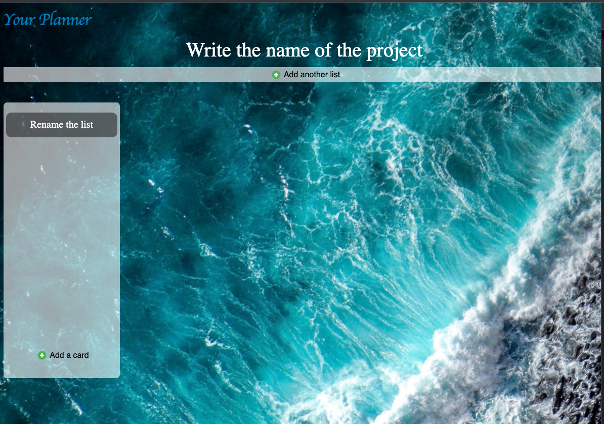
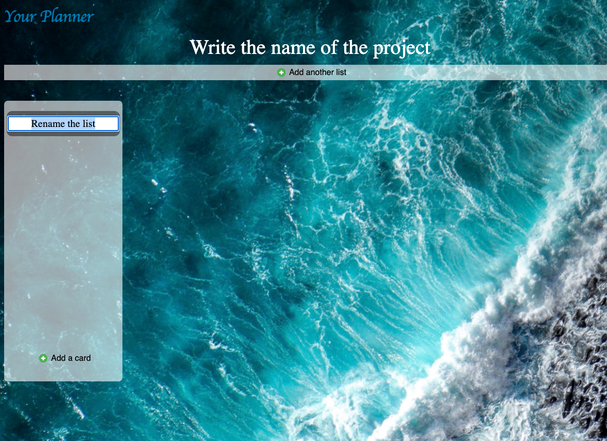
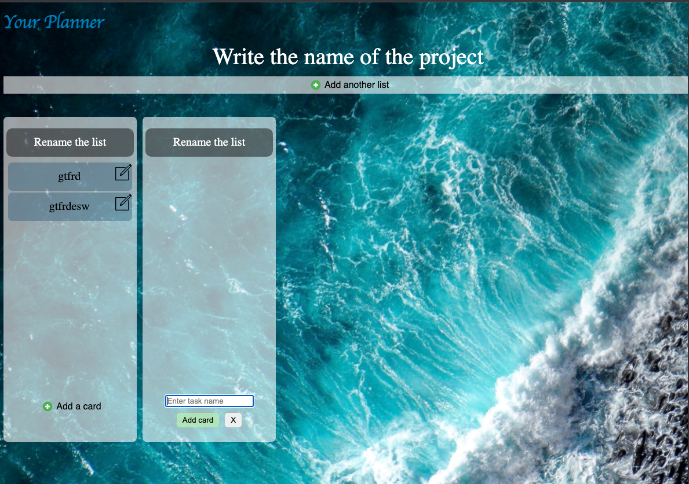

In this planner you can create lists/tasks and move them around.

Used react, <a href="https://github.com/atlassian/react-beautiful-dnd">react-beautiful-dnd</a>, scss, grid

<h2>Screenshots</h2>

<ol>
    <li>Planner without lists
        <ul>
            <li>
                
            </li>
        </ul>
    </li>
    <li>Planner with a list:
        <ul>
            <li>
                
            </li>
        </ul>
    </li>
    <li>Rename list:
        <ul>
            <li>
                
            </li>
        </ul>
    </li>
     <li>Created tasks and task creation:
        <ul>
            <li>
                
            </li>
        </ul>
    </li>
    <li>Dnd the list:
        <ul>
            <li>
                
            </li>
        </ul>
    </li>
        <li>Dnd the task:
        <ul>
            <li>
                
            </li>
        </ul>
    </li>
</ol>